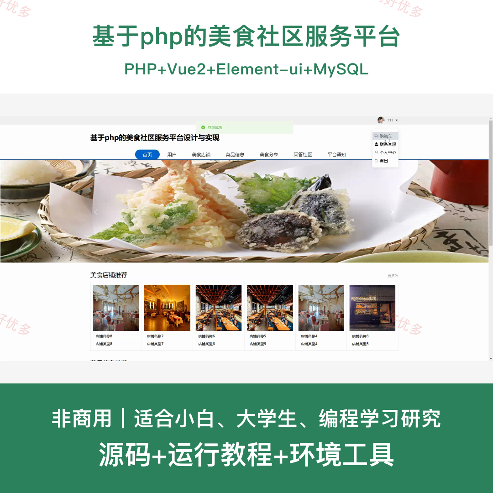
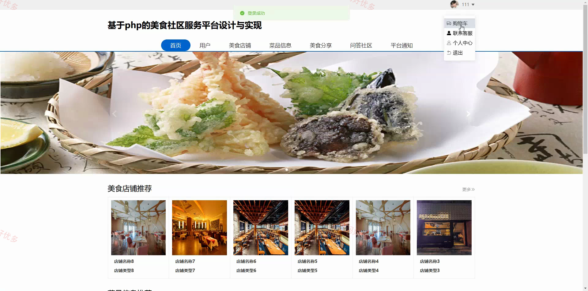
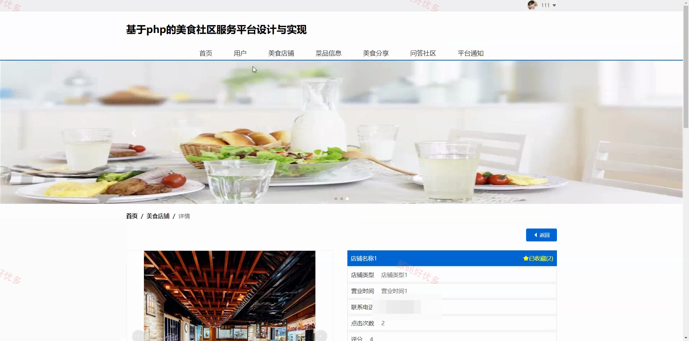
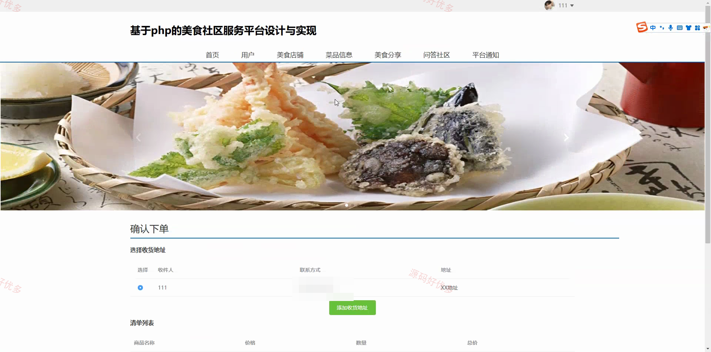
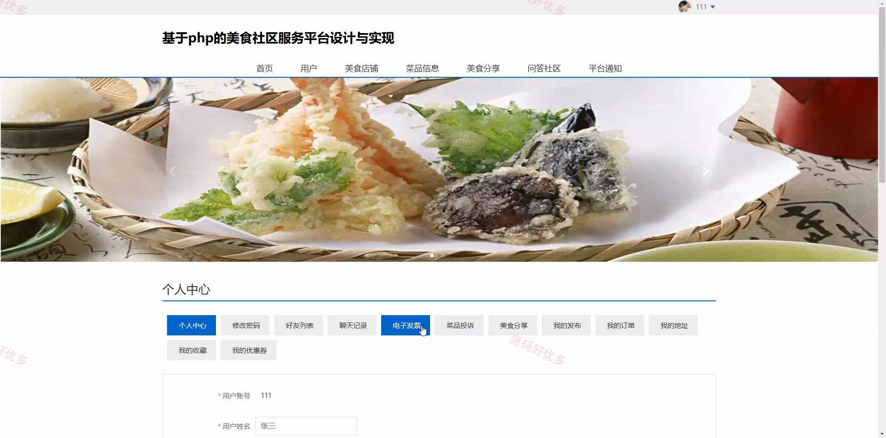
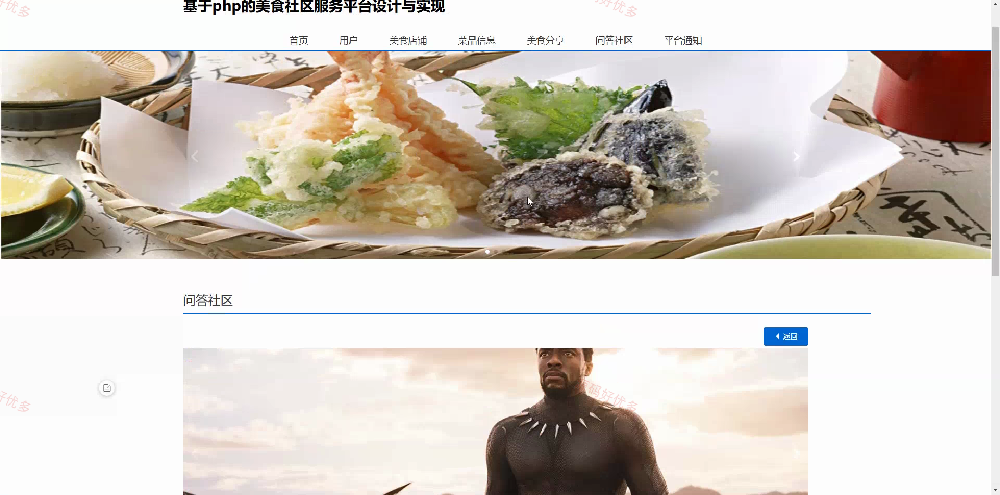
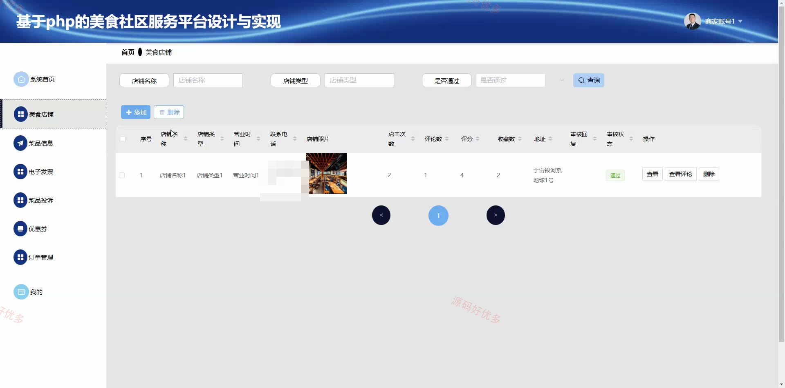
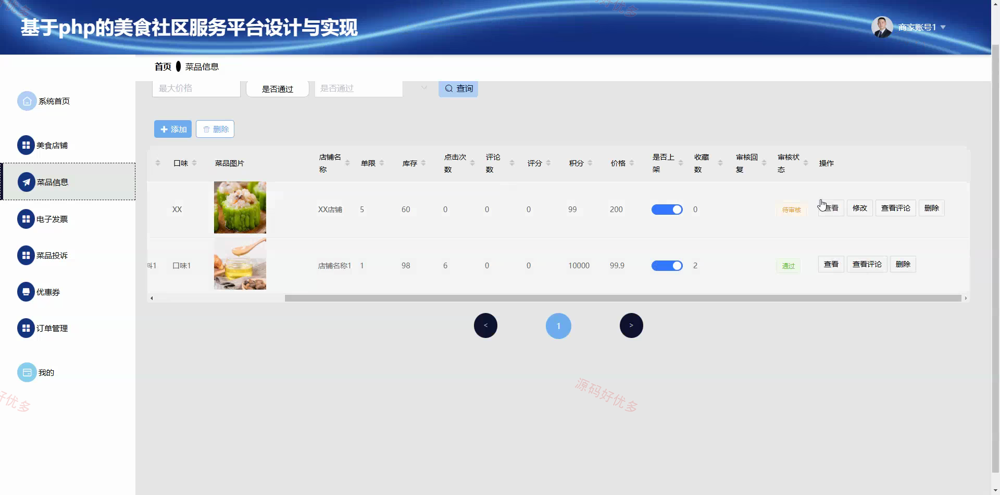
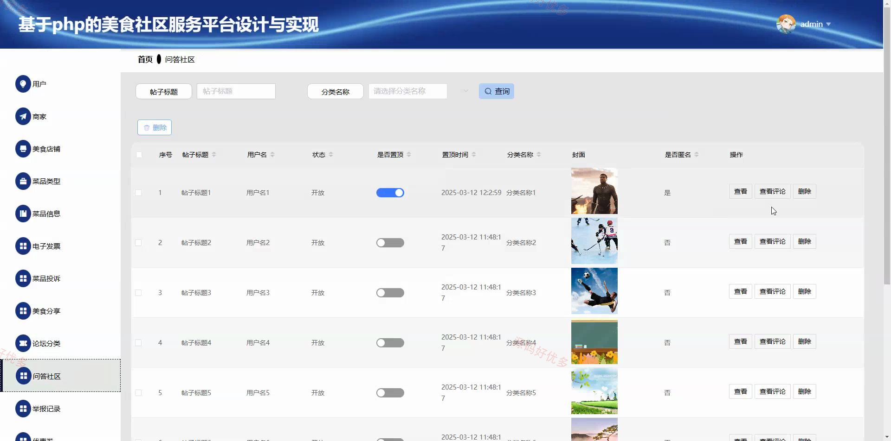

# php007D-
php007D 基于php的美食社区服务平台
## 源码问题查看主页咨询

### 一、关键词
美食社区、美食分享、菜品点评、餐饮交流、在线点餐

### 二、作品包含
源码+数据库+全套环境和工具资源+本地部署教程

### 三、项目技术
前端技术： Html、Css、Js、Vue2.6、Element-ui
后端技术：PHP

### 四、运行环境（以下版本亲测，其他版本兼容性请自行测试）
开发工具：PhpStorm/VSCODE + VSCODE

数据库：MySQL5.7+（共29张表）

数据库管理工具：Navicat10以上版本

环境配置软件： PHP

前端Nodejs：14+

浏览器：谷歌浏览器

### 五、项目介绍
项目编号：php007D

本平台面向用户、商家和管理员构建美食内容交流与在线点餐服务。用户可以浏览美食店铺与菜品，收藏和评论内容，发布美食分享，参与问答社区，并完成购物车、订单、支付、投诉及电子发票等操作；商家负责维护店铺与菜品、优惠券、订单配送和售后处理；管理员负责用户商家审核、业务内容管理、社区治理、平台通知以及订单销售统计。

角色：用户、商家、管理员

用户功能：美食店铺浏览与收藏、菜品浏览与在线投诉、购物车管理、下单与支付、订单查看与处理、电子发票查看、美食分享发布与管理、问答社区交流与举报。

商家功能：店铺与菜品信息管理、菜品评论查看、电子发票管理、菜品投诉审核、优惠券管理、订单发货与物流、退货审核与订单统计、平台通知查看。

管理员功能：用户与商家审核管理、美食店铺与菜品审核管理、菜品类型管理、电子发票与投诉管理、美食分享审核与评论管理、问答社区与举报管理、优惠券与通知管理、分类订单与销售统计。

### 六、运行截图

